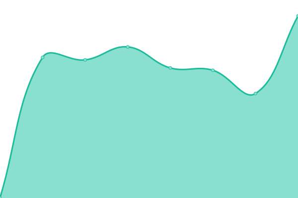
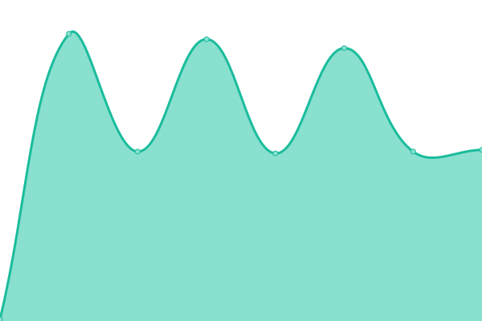
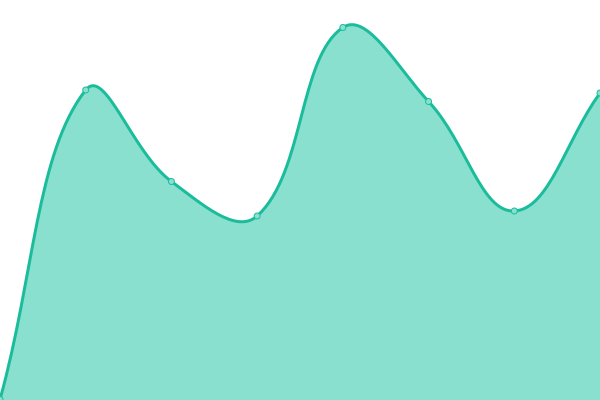

# [📈 Live Status](https://status.zkyrylo.eu.org): <!--live status--> **🟩 All systems operational**

This repository contains the open-source uptime monitor and status page for [Chiminori](https://chiminori.eu.org), powered by [Upptime](https://github.com/upptime/upptime).

With [Upptime](https://upptime.js.org), you can get your own unlimited and free uptime monitor and status page, powered entirely by a GitHub repository. We use [Issues](https://github.com/kirilloooo/status/issues) as incident reports, [Actions](https://github.com/kirilloooo/status/actions) as uptime monitors, and [Pages](https://status.zkyrylo.eu.org) for the status page.

<!--start: status pages-->
<!-- This summary is generated by Upptime (https://github.com/upptime/upptime) -->
<!-- Do not edit this manually, your changes will be overwritten -->
<!-- prettier-ignore -->
| URL | Status | History | Response Time | Uptime |
| --- | ------ | ------- | ------------- | ------ |
|  [KiroDomains](https://kiro.pw) | 🟩 Up | [kiro-domains.yml](https://github.com/kirilloooo/status/commits/HEAD/history/kiro-domains.yml) | 

 755ms
     
 | 

<a href="https://status.zkyrylo.eu.org/history/kiro-domains">100.00%</a>
    

|  [KiroMail](https://m.kiro.pw) | 🟩 Up | [kiro-mail.yml](https://github.com/kirilloooo/status/commits/HEAD/history/kiro-mail.yml) | 

 1340ms
     
 | 

<a href="https://status.zkyrylo.eu.org/history/kiro-mail">98.98%</a>
    

|  [ShortLink](https://go.kiro.pw) | 🟩 Up | [short-link.yml](https://github.com/kirilloooo/status/commits/HEAD/history/short-link.yml) | 

 1613ms
     
 | 

<a href="https://status.zkyrylo.eu.org/history/short-link">100.00%</a>
    

|  [FusionFlow](https://fusionflow.cc.nf) | 🟩 Up | [fusion-flow.yml](https://github.com/kirilloooo/status/commits/HEAD/history/fusion-flow.yml) | 

 1225ms
     
 | 

<a href="https://status.zkyrylo.eu.org/history/fusion-flow">58.83%</a>
    

|  [PLTFRM](https://platform.eu.org) | 🟩 Up | [pltfrm.yml](https://github.com/kirilloooo/status/commits/HEAD/history/pltfrm.yml) | 

 220ms
     
 | 

<a href="https://status.zkyrylo.eu.org/history/pltfrm">100.00%</a>
    

|  [ytics](https://fy.oo.gd) | 🟩 Up | [ytics.yml](https://github.com/kirilloooo/status/commits/HEAD/history/ytics.yml) | 

 1307ms
     
 | 

<a href="https://status.zkyrylo.eu.org/history/ytics">100.00%</a>
    

|  [KiroDomains Support](https://support.kiro.pw) | 🟩 Up | [kiro-domains-support.yml](https://github.com/kirilloooo/status/commits/HEAD/history/kiro-domains-support.yml) | 

 973ms
     
 | 

<a href="https://status.zkyrylo.eu.org/history/kiro-domains-support">97.89%</a>
    

|  [KiroAPI](https://api.kiro.pw) | 🟩 Up | [kiro-api.yml](https://github.com/kirilloooo/status/commits/HEAD/history/kiro-api.yml) | 

 599ms
     
 | 

<a href="https://status.zkyrylo.eu.org/history/kiro-api">100.00%</a>
    

|  t.me/FileWithURLBot | 🟩 Up | [t-me-file-with-url-bot.yml](https://github.com/kirilloooo/status/commits/HEAD/history/t-me-file-with-url-bot.yml) | 

 563ms
     
 | 

<a href="https://status.zkyrylo.eu.org/history/t-me-file-with-url-bot">99.70%</a>
    

<!--end: status pages-->

[**Visit our status website →**](https://status.zkyrylo.eu.org)

## 📄 License

- Powered by: [Upptime](https://github.com/upptime/upptime)
- Code: [MIT](./LICENSE) © [Anand Chowdhary](https://anandchowdhary.com), supported by [Pabio](https://pabio.com)
- Data in the `./history` directory: [Open Database License](https://opendatacommons.org/licenses/odbl/1-0/)
